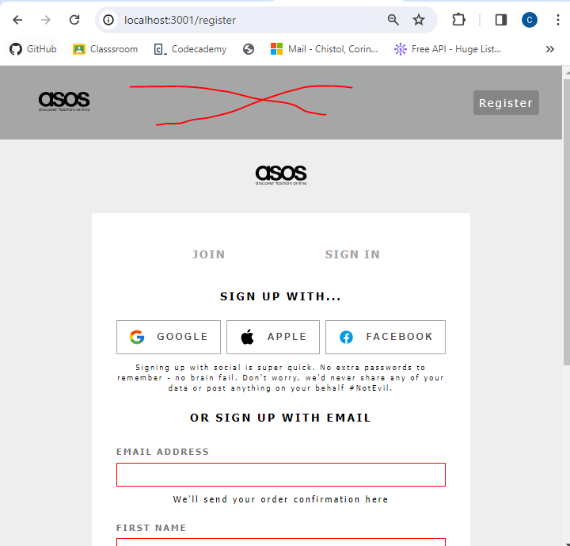
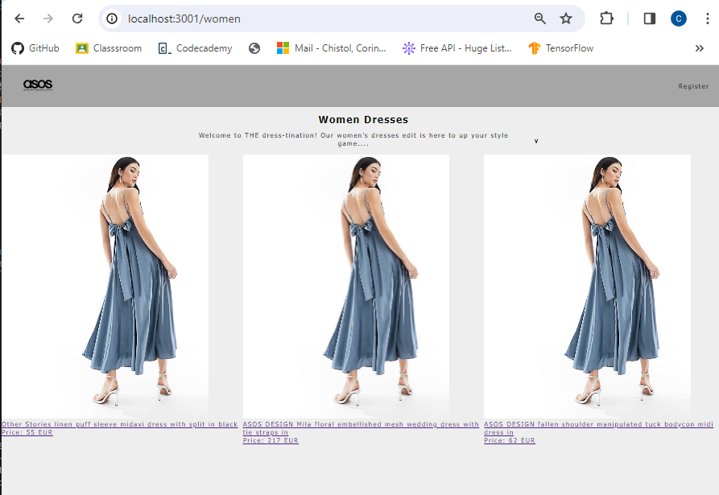
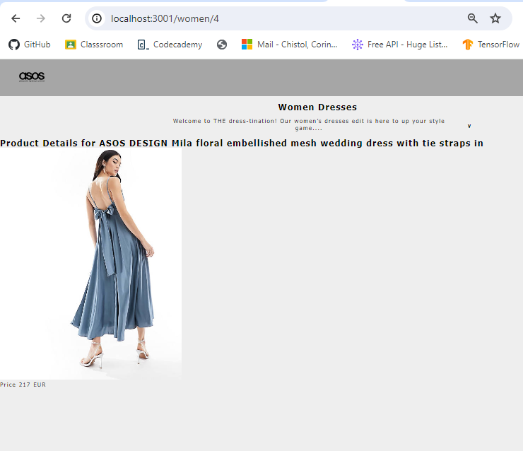

1. Home page

2. Register - ideal ar fi sa dispara aici navbar-ul si sa apara doar dupa ce user-ul s-a logat

3. In FormSignUp am modificat adresa in locul datii de nastere. In baza de date tot adresa am adaugat, cu date e mai complicat si ma blochez

4. Dupa ce s-a autentificat user-ul, vreau sa apara RootLayout ..\client\src\layouts\RootLayout.js
    si s-a aiba access la produse,cos,faq

5. La produse , vreau sa fac compound composition, cu details, rating si inca ceva...

6. Sa aduc shopping cart aici.

Pe partea de server sunt CRUD client routes, CR pentru products, auth routes.

Update:
Am listat citeva produse, dar am probleme cu afisarea imaginilor din cauza CORB

Product/id

